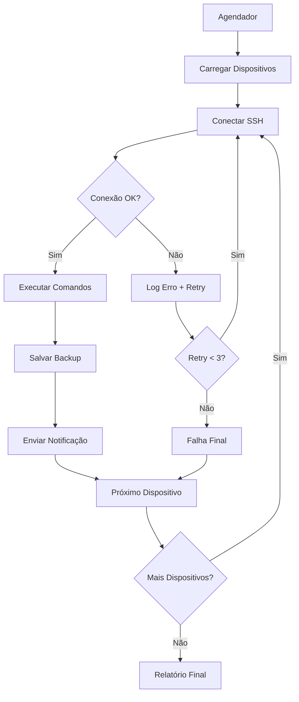

# 🔧 Sistema de Backup Automatizado para Equipamentos Datacom

> **Sistema profissional para backup automático de configurações de equipamentos Datacom via SSH com notificações inteligentes por Telegram.**

[](https://www.docker.com/)
[](https://www.python.org/)
[](https://www.datacom.com.br/)
[](LICENSE)

---

## 📋 Índice

- [🎯 Visão Geral](#-visão-geral)
- [✨ Funcionalidades](#-funcionalidades)
- [🚀 Instalação Rápida](#-instalação-rápida)
- [⚙️ Configuração Detalhada](#️-configuração-detalhada)
- [📱 Configuração do Telegram](#-configuração-do-telegram)
- [🎮 Como Usar](#-como-usar)
- [📁 Estrutura dos Backups](#-estrutura-dos-backups)
- [🔧 Comandos e Scripts](#-comandos-e-scripts)
- [🚨 Solução de Problemas](#-solução-de-problemas)
- [🔒 Segurança](#-segurança)
- [📊 Monitoramento](#-monitoramento)
- [🏗️ Arquitetura do Projeto](#️-arquitetura-do-projeto)

---

## 🎯 Visão Geral

Este sistema foi desenvolvido especificamente para **automatizar backups de equipamentos Datacom** (switches, roteadores, OLTs) em ambientes corporativos. Ele conecta via SSH aos dispositivos, coleta as configurações e envia notificações inteligentes sobre o status dos backups.

### 🎪 Por que usar este sistema?

- ✅ **Automatização completa** - Configure uma vez e esqueça
- ✅ **Notificações inteligentes** - Saiba imediatamente se algo deu errado
- ✅ **Fácil de instalar** - Pronto para usar em minutos
- ✅ **Seguro e confiável** - Logs detalhados e tratamento de erros
- ✅ **Específico para Datacom** - Comandos otimizados para equipamentos Datacom

---

## ✨ Funcionalidades

### 🔄 **Backup Automático**
- Agendamento diário (02:00) e semanal (Domingo 01:00)
- Backup paralelo de múltiplos dispositivos
- Retry automático em caso de falha temporária

### 📁 **Gestão de Arquivos**
- Backup completo da configuração `show running-config`
- Informações detalhadas do sistema (opcional)
- Limpeza automática de backups antigos (configurável)
- Organização por dispositivo e data

### 📱 **Notificações Inteligentes**
- Alertas em tempo real via Telegram
- Relatórios de sucesso/falha detalhados
- Estatísticas de backup (tempo, dispositivos, erros)

### 🐳 **Containerização**
- Totalmente containerizado com Docker
- Fácil deploy e manutenção
- Isolamento de dependências
- Health checks automáticos

### 📊 **Monitoramento**
- Logs detalhados com rotação automática
- Métricas de performance
- Alertas de falha recorrente

---

## 🚀 Instalação Rápida

### Pré-requisitos

- **Docker** e **Docker Compose** instalados
- **Acesso SSH** aos equipamentos Datacom
- **Bot do Telegram** (opcional, mas recomendado)

### 1️⃣ Clone e Prepare o Projeto

```bash
# Clone o repositório
git clone <seu-repositorio>
cd backup-datacom

# Torne os scripts executáveis
chmod +x scripts/*.sh

# Verifique a estrutura
ls -la
```

### 2️⃣ Configure o Ambiente

```bash
# Copie o arquivo de exemplo
cp .env.example .env

# Edite suas configurações
nano .env
```

### 3️⃣ Configure os Dispositivos

```bash
# Edite a configuração dos dispositivos
nano config/devices.json
```

### 4️⃣ Inicie o Sistema

```bash
# Construa e inicie os containers
docker compose up -d

# Verifique se está funcionando
docker compose ps
```

### 5️⃣ Teste o Primeiro Backup

```bash
# Execute um backup manual para testar
./scripts/backup-manual.sh
```

**🎉 Pronto! Seu sistema está funcionando!**

---

## ⚙️ Configuração Detalhada

### 📄 Arquivo `.env` - Configurações Gerais

```env
# ===========================================
# CONFIGURAÇÕES DO TELEGRAM (OPCIONAL)
# ===========================================
# Token do bot (obtenha com @BotFather)
TELEGRAM_BOT_TOKEN=seu_token_aqui

# ID do chat (usuário ou grupo)
TELEGRAM_CHAT_ID=seu_chat_id_aqui

# ===========================================
# CONFIGURAÇÕES DE BACKUP
# ===========================================
# Quantos dias manter os backups (padrão: 30)
BACKUP_RETENTION_DAYS=30

# Coletar informações detalhadas do sistema
# true = coleta info adicional | false = apenas config
COLLECT_SYSTEM_INFO=false

# ===========================================
# CONFIGURAÇÕES DE REDE
# ===========================================
# Timeout para conexões SSH (segundos)
SSH_TIMEOUT=30

# Timeout geral de rede (segundos)
NETWORK_TIMEOUT=45

# Máximo de backups simultâneos
MAX_CONCURRENT_BACKUPS=5
```

### 📄 Arquivo `config/devices.json` - Seus Equipamentos

```json
{
  "devices": [
    {
      "name": "switch-core-matriz",
      "host": "192.168.1.10",
      "port": 22,
      "username": "admin",
      "password": "sua_senha_segura",
      "description": "Switch Core Datacom DM4100 - Matriz Principal",
      "timeout": 30
    },
    {
      "name": "router-wan-principal",
      "host": "192.168.1.1",
      "port": 22,
      "username": "admin",
      "password": "sua_senha_segura",
      "description": "Roteador Datacom DM991 - Gateway Principal",
      "timeout": 45
    },
    {
      "name": "olt-gpon-01",
      "host": "192.168.1.50",
      "port": 22,
      "username": "backup-user",
      "password": "senha_olt",
      "description": "OLT Datacom DM4610 - GPON Principal",
      "timeout": 60
    }
  ]
}
```

#### 📝 Explicação dos Parâmetros:

| Parâmetro | Descrição | Exemplo |
|-----------|-----------|----------|
| `name` | Nome único do dispositivo (sem espaços) | `switch-core-01` |
| `host` | IP ou hostname do equipamento | `192.168.1.10` |
| `port` | Porta SSH (geralmente 22) | `22` |
| `username` | Usuário com privilégios de leitura | `admin` |
| `password` | Senha do usuário | `senha123` |
| `description` | Descrição amigável | `Switch Core - Andar 1` |
| `timeout` | Timeout específico (segundos) | `30` |

---

## 📱 Configuração do Telegram

### 🤖 Criando seu Bot

1. **Abra o Telegram** e procure por `@BotFather`
2. **Envie o comando** `/newbot`
3. **Escolha um nome** para seu bot (ex: "Backup Datacom Bot")
4. **Escolha um username** (ex: "backup_datacom_bot")
5. **Copie o token** fornecido (formato: `123456789:ABCdef...`)

### 🆔 Obtendo o Chat ID

#### Para usuário individual:
```bash
# 1. Envie uma mensagem qualquer para seu bot
# 2. Execute este comando (substitua SEU_TOKEN):
curl -s "https://api.telegram.org/botSEU_TOKEN/getUpdates" | jq '.result[0].message.chat.id'
```

#### Para grupo:
```bash
# 1. Adicione o bot ao grupo
# 2. Envie uma mensagem no grupo mencionando o bot
# 3. Use o mesmo comando acima
# O chat ID de grupos é negativo (ex: -123456789)
```

### ✅ Testando a Configuração

```bash
# Teste se o token está correto
curl -s "https://api.telegram.org/bot<SEU_TOKEN>/getMe"

# Teste enviando uma mensagem
curl -s -X POST "https://api.telegram.org/bot<SEU_TOKEN>/sendMessage" \
  -d chat_id=<SEU_CHAT_ID> \
  -d text="Teste de configuração do bot!"
```

---

## 🎮 Como Usar

### 🔧 Comandos Principais

```bash
# 📦 Backup manual (recomendado para testes)
./scripts/backup-manual.sh

# 🧹 Limpeza manual de backups antigos
./scripts/cleanup.sh

# 🔧 Corrigir permissões (se necessário)
./scripts/fix-permissions.sh

# 📊 Ver status do sistema
docker compose ps

# 📋 Ver logs em tempo real
docker compose logs -f datacom-backup

# 🔄 Reiniciar o sistema
docker compose restart
```

### ⏰ Agendamentos Automáticos

O sistema executa automaticamente:

| Tarefa | Horário | Descrição |
|--------|---------|----------|
| **Backup Diário** | 02:00 | Backup de todos os dispositivos |
| **Backup Semanal** | Domingo 01:00 | Backup completo + verificação |
| **Limpeza** | Segunda 03:00 | Remove backups antigos |

### 🎯 Comandos Avançados

```bash
# Executar backup de um dispositivo específico
docker compose exec datacom-backup python src/datacom_backup.py backup

# Executar limpeza manual
docker compose exec datacom-backup python src/datacom_backup.py cleanup

# Ver ajuda completa
docker compose exec datacom-backup python src/datacom_backup.py --help
```

---

## 📁 Estrutura dos Backups

### 🗂️ Organização dos Arquivos

```
backups/
├── switch-core-matriz/
│   ├── switch-core-matriz_20240129_020015.txt     # Configuração running-config
│   ├── switch-core-matriz_20240129_020015_info.txt # Info do sistema (se habilitado)
│   ├── switch-core-matriz_20240128_020012.txt
│   └── switch-core-matriz_20240127_020009.txt
├── router-wan-principal/
│   ├── router-wan-principal_20240129_020045.txt
│   └── router-wan-principal_20240128_020042.txt
└── olt-gpon-01/
    ├── olt-gpon-01_20240129_020115.txt
    └── olt-gpon-01_20240128_020112.txt
```

### 📄 Conteúdo dos Arquivos

#### **Arquivo Principal** (`*_YYYYMMDD_HHMMSS.txt`)
- Configuração completa `show running-config`
- Pronto para restore em caso de necessidade
- Formato texto puro, fácil de ler

#### **Arquivo de Informações** (`*_YYYYMMDD_HHMMSS_info.txt`) - Opcional
- Versão do sistema operacional
- Informações de hardware
- Status das interfaces
- Uso de CPU e memória
- Tabela de roteamento (resumo)
- Tempo de funcionamento (uptime)

---

## 🔧 Comandos e Scripts

### 📜 Scripts Disponíveis

#### `./scripts/backup-manual.sh`
```bash
# Executa backup manual de todos os dispositivos
# Útil para testes e backups sob demanda
./scripts/backup-manual.sh
```

#### `./scripts/cleanup.sh`
```bash
# Remove backups antigos baseado na configuração BACKUP_RETENTION_DAYS
./scripts/cleanup.sh
```

#### `./scripts/fix-permissions.sh`
```bash
# Corrige permissões dos diretórios de backup e logs
# Use se encontrar erros de "Permission denied"
sudo ./scripts/fix-permissions.sh
```

### 🔧 Comandos Datacom Utilizados

O sistema utiliza comandos específicos otimizados para equipamentos Datacom:

| Comando | Finalidade | Arquivo |
|---------|------------|----------|
| `show running-config` | Backup da configuração | Principal |
| `show version` | Versão do sistema | Info |
| `show system` | Informações do hardware | Info |
| `show interface link` | Status das interfaces | Info |
| `show ip route summary` | Resumo da tabela de roteamento | Info |
| `show system uptime` | Tempo de funcionamento | Info |
| `show system memory` | Uso de memória | Info |
| `show system cpu` | Uso de CPU | Info |

### 🐳 Comandos Docker Úteis

```bash
# Gerenciamento de containers
docker compose up -d              # Iniciar em background
docker compose down               # Parar e remover containers
docker compose restart            # Reiniciar serviços
docker compose ps                 # Status dos containers

# Logs e debugging
docker compose logs -f datacom-backup    # Logs em tempo real
docker compose logs --tail=100           # Últimas 100 linhas
docker compose exec datacom-backup bash  # Acesso ao container

# Manutenção
docker compose build --no-cache   # Reconstruir imagens
docker system prune -f            # Limpar recursos não utilizados
```

---

## 🚨 Solução de Problemas

### ❌ Problemas Comuns e Soluções

#### **1. Erro de Conexão SSH**

**Sintomas:**
```
ERROR - Falha na conexão SSH para device-name: [Errno 111] Connection refused
```

**Soluções:**
```bash
# Teste a conectividade
ping 192.168.1.10

# Teste SSH manual
ssh admin@192.168.1.10

# Verifique se SSH está habilitado no equipamento
# No equipamento Datacom:
enable
configure
ip ssh server
commit
```

#### **2. Erro de Autenticação**

**Sintomas:**
```
ERROR - Falha na autenticação SSH: Authentication failed
```

**Soluções:**
- ✅ Verifique usuário e senha no `config/devices.json`
- ✅ Confirme se o usuário tem privilégios adequados
- ✅ Teste login manual via SSH

#### **3. Container não Inicia**

**Sintomas:**
```
Container datacom-backup exited with code 1
```

**Soluções:**
```bash
# Ver logs detalhados
docker compose logs datacom-backup

# Verificar configurações
cat .env
cat config/devices.json

# Reconstruir container
docker compose down
docker compose build --no-cache
docker compose up -d
```

#### **4. Erro de Permissões**

**Sintomas:**
```
PermissionError: [Errno 13] Permission denied: '/app/backups/device-name'
```

**Soluções:**
```bash
# Corrigir permissões automaticamente
./scripts/fix-permissions.sh

# Ou manualmente
sudo chown -R 1000:1000 backups/ logs/ config/
sudo chmod -R 755 backups/ logs/
```

#### **5. Telegram não Funciona**

**Sintomas:**
```
ERROR - Falha ao enviar notificação Telegram
```

**Soluções:**
```bash
# Testar token
curl "https://api.telegram.org/bot<TOKEN>/getMe"

# Testar envio de mensagem
curl -X POST "https://api.telegram.org/bot<TOKEN>/sendMessage" \
  -d chat_id=<CHAT_ID> \
  -d text="Teste"

# Verificar logs específicos
docker compose logs datacom-backup | grep -i telegram
```

#### **6. Comandos Datacom não Funcionam**

**Sintomas:**
```
ERROR - Comando 'show running-config' falhou
```

**Soluções:**
```bash
# Teste manual no equipamento
ssh admin@192.168.1.10
show ?
show running-config

# Verifique se o usuário tem privilégios
enable
show privilege
```

### 🔍 Debugging Avançado

```bash
# Logs detalhados do sistema
tail -f logs/datacom_backup_*.log

# Verificar espaço em disco
df -h
du -sh backups/

# Verificar conectividade de rede
docker compose exec datacom-backup ping 192.168.1.10

# Teste de comandos SSH
docker compose exec datacom-backup python -c "
import paramiko
ssh = paramiko.SSHClient()
ssh.set_missing_host_key_policy(paramiko.AutoAddPolicy())
ssh.connect('192.168.1.10', username='admin', password='senha')
stdin, stdout, stderr = ssh.exec_command('show version')
print(stdout.read().decode())
"
```

---

## 🔒 Segurança

### 🛡️ Boas Práticas de Segurança

#### **1. Senhas e Credenciais**
- ✅ Use senhas fortes e únicas para cada equipamento
- ✅ Considere usar autenticação por chave SSH
- ✅ Mantenha backup seguro do arquivo `.env`
- ✅ Não commite credenciais no Git

#### **2. Rede e Acesso**
- ✅ Configure ACLs para restringir acesso SSH
- ✅ Use VLANs de gerenciamento isoladas
- ✅ Implemente firewall nos equipamentos
- ✅ Monitore tentativas de acesso

#### **3. Sistema de Backup**
- ✅ Execute em rede isolada quando possível
- ✅ Criptografe backups sensíveis
- ✅ Monitore logs de acesso
- ✅ Mantenha sistema atualizado

### 🔐 Configuração de Chaves SSH (Recomendado)

```bash
# 1. Gerar par de chaves
ssh-keygen -t rsa -b 4096 -f ~/.ssh/datacom_backup

# 2. Copiar chave pública para equipamentos
ssh-copy-id -i ~/.ssh/datacom_backup.pub admin@192.168.1.10

# 3. Atualizar devices.json (remover password, adicionar key_file)
{
  "name": "switch-core-01",
  "host": "192.168.1.10",
  "username": "admin",
  "key_file": "/app/.ssh/datacom_backup",
  "description": "Switch Core com autenticação por chave"
}
```

---

## 📊 Monitoramento

### 📈 Métricas Importantes

#### **1. Taxa de Sucesso**
```bash
# Ver estatísticas dos últimos backups
grep -c "concluído com sucesso" logs/datacom_backup_*.log
grep -c "ERRO\|ERROR" logs/datacom_backup_*.log
```

#### **2. Tempo de Execução**
```bash
# Analisar tempo médio de backup
grep "Backup concluído" logs/datacom_backup_*.log | tail -10
```

#### **3. Espaço Utilizado**
```bash
# Espaço total dos backups
du -sh backups/

# Espaço por dispositivo
du -sh backups/*/

# Crescimento diário
find backups/ -name "*.txt" -mtime -1 -exec du -ch {} + | tail -1
```

#### **4. Dispositivos com Falha**
```bash
# Dispositivos que falharam recentemente
grep -l "ERRO\|ERROR" logs/datacom_backup_*.log | xargs grep -h "device:"
```

### 📊 Dashboard de Monitoramento

```bash
#!/bin/bash
# Script de monitoramento rápido

echo "=== STATUS DO SISTEMA DE BACKUP DATACOM ==="
echo "Data: $(date)"
echo ""

echo "📊 ESTATÍSTICAS GERAIS:"
echo "Total de dispositivos: $(jq '.devices | length' config/devices.json)"
echo "Espaço usado: $(du -sh backups/ | cut -f1)"
echo "Arquivos de backup: $(find backups/ -name '*.txt' | wc -l)"
echo ""

echo "📈 ÚLTIMOS BACKUPS:"
grep "Backup concluído" logs/datacom_backup_*.log | tail -5
echo ""

echo "❌ ERROS RECENTES:"
grep "ERROR\|ERRO" logs/datacom_backup_*.log | tail -3
echo ""

echo "🐳 STATUS DOCKER:"
docker compose ps
```

### 🚨 Alertas Automáticos

O sistema envia notificações Telegram para:
- ✅ Backup concluído com sucesso
- ❌ Falhas de backup
- ⚠️ Dispositivos inacessíveis
- 📊 Relatórios semanais
- 🧹 Limpeza de arquivos antigos

---

## 🏗️ Arquitetura do Projeto

### 📂 Estrutura Completa

```
backup-datacom/
├── 📁 src/                          # Código fonte
│   └── datacom_backup.py            # Script principal Python
├── 📁 config/                       # Configurações
│   ├── devices.json                 # Seus equipamentos
│   └── devices.json.example         # Exemplo de configuração
├── 📁 scripts/                      # Scripts de automação
│   ├── backup-manual.sh             # Backup manual
│   ├── cleanup.sh                   # Limpeza de arquivos
│   └── fix-permissions.sh           # Correção de permissões
├── 📁 backups/                      # Arquivos de backup
│   ├── device-1/                    # Backups do dispositivo 1
│   ├── device-2/                    # Backups do dispositivo 2
│   └── device-n/                    # Backups do dispositivo N
├── 📁 logs/                         # Logs do sistema
│   └── datacom_backup_YYYYMMDD.log  # Logs diários
├── 🐳 docker-compose.yml            # Orquestração Docker
├── 🐳 Dockerfile                    # Imagem Docker
├── 📄 requirements.txt              # Dependências Python
├── ⚙️ .env                          # Suas configurações (criar)
├── ⚙️ .env.example                  # Exemplo de configurações
├── 🎨 telegram-notification.svg     # Ilustração das notificações
└── 📖 README.md                     # Esta documentação
```

### 🔧 Componentes Principais

#### **1. datacom_backup.py** - Motor Principal
- Gerenciamento de conexões SSH
- Execução de comandos Datacom
- Salvamento de configurações
- Envio de notificações
- Agendamento de tarefas
- Limpeza automática

#### **2. Docker Container** - Ambiente Isolado
- Python 3.11+ com dependências
- Usuário dedicado para segurança
- Volumes persistentes para dados
- Health checks automáticos
- Logs estruturados

#### **3. Scripts de Automação** - Facilidade de Uso
- Backup manual para testes
- Limpeza sob demanda
- Correção de permissões
- Monitoramento simplificado

### 🔄 Fluxo de Funcionamento



### 🛠️ Tecnologias Utilizadas

| Tecnologia | Versão | Finalidade |
|------------|--------|------------|
| **Python** | 3.11+ | Linguagem principal |
| **Paramiko** | 3.4+ | Conexões SSH |
| **Schedule** | 1.2+ | Agendamento de tarefas |
| **Requests** | 2.31+ | API do Telegram |
| **Docker** | 20+ | Containerização |
| **Docker Compose** | 2+ | Orquestração |

---

## 🎯 Equipamentos Datacom Suportados

### ✅ Modelos Testados e Compatíveis

#### **Switches**
- **DM2100 Series** - Switches de acesso
- **DM4100 Series** - Switches core/distribuição
- **DM4000 Series** - Switches gerenciáveis
- **DM4270 Series** - Switches L3
- **DM4380 Series** - Switches agregação

#### **Roteadores**
- **DM991 Series** - Roteadores de borda
- **DM2500 Series** - Roteadores corporativos
- **DM705 Series** - Roteadores compactos

#### **GPON/OLTs**
- **DM4610 Series** - OLTs GPON
- **DM4611 Series** - OLTs GPON avançadas

#### **Outros Equipamentos**
- Qualquer equipamento Datacom com CLI compatível
- Firmware DmOS 5.x ou superior
- Suporte a comandos `show running-config`

### ⚙️ Requisitos dos Equipamentos

- ✅ **SSH habilitado** (`ip ssh server`)
- ✅ **Usuário com privilégios** de leitura
- ✅ **Conectividade de rede** com o servidor
- ✅ **CLI padrão Datacom** (DmOS)

---

### 🐛 Reportar Problemas

Se encontrar algum problema:

1. **Verifique os logs**: `docker compose logs datacom-backup`
2. **Teste conectividade**: `ping` e `ssh` manual
3. **Consulte esta documentação**: Seção "Solução de Problemas"
4. **Abra uma issue** com logs e detalhes

---

**🚀 Sistema desenvolvido especificamente para equipamentos Datacom**

*Compatível com switches, roteadores e OLTs da linha Datacom com interface CLI padrão*